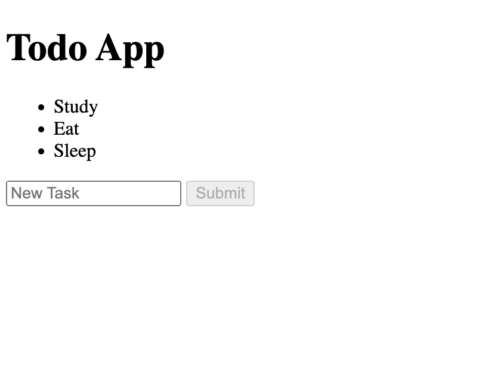

# ToDo App Exercise - Flask
Welcome to the ToDo App Exercise with Flask! In this assignment, you'll be creating a basic ToDo application using Flask, a micro web framework written in Python. The goal is to understand how to handle web requests and dynamically update web pages using server-side logic with Flask.

This exercise is designed to be run entirely within a development container, which means you don't need to install Python, Flask, or any other dependencies on your local machine—everything will be ready for you to use in the provided development environment.

Once you have completed your version of the ToDo app, you can compare it with our sample solution which is available in the answer folder.

You'll write only in `app.py` and `index.hmtl`. If you want to see the solution, check the `answer` folder.

## 🎯 Objective:
Build a Flask-based web application that allows users to:

1. Enter a task using a form.
2. View the tasks they've added to a global list that gets updated with each new entry.

## ✅ Specific Tasks:
Your tasks for this exercise are outlined as follows:

### Set Up the HTML Form:
1. Design a form in index.html that includes:
- An `<input>` field for users to type their tasks.
- A `<button>` to submit the task to the list.

2. Create Unordered List in HTML:
- Add an `<ul>` element where the tasks will appear as `<li>` elements.

3. In app.py, set up Flask routes to handle:
- Displaying the current list of tasks.
- Adding a new task to the list when the form is submitted.

## 📘 How to Run Your Website:
Start the Flask Server: `python -m flask run`
Access the application by navigating to `localhost:5000` in your web browser.

## 🚀 How to Run Tests:
1. Ensure your Flask server is not running, or it will occupy the terminal.
2. In your terminal, run `python test_app.py`.

## 🤔 How to Submit:
Once all the tests have completed:

1. Stage Changes:
  - View your changes in the Source Control view.
  - Click on the + (plus) sign next to the files you wish to stage.
2. Commit Changes:
  - Enter a descriptive commit message.
  - Press Ctrl + Enter (or Cmd + Enter on macOS) to commit the changes.
3. Push Changes:
  - Click on the ellipsis ... in the Source Control view.
  - Select Push.
4.Verify you code has passed

## How the Project will Look Like

